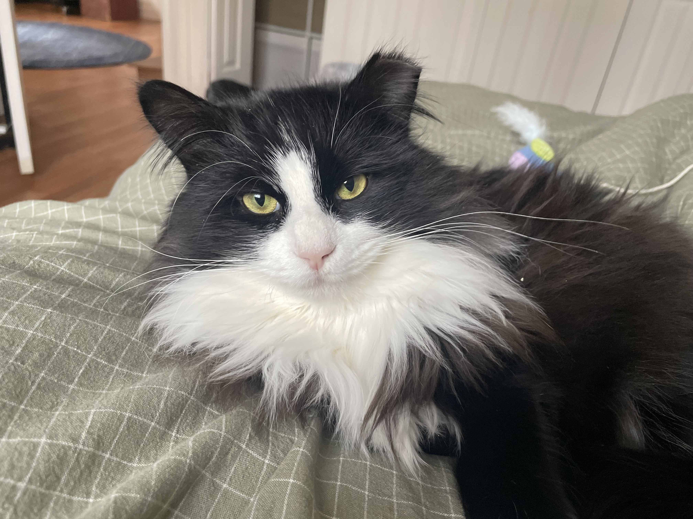
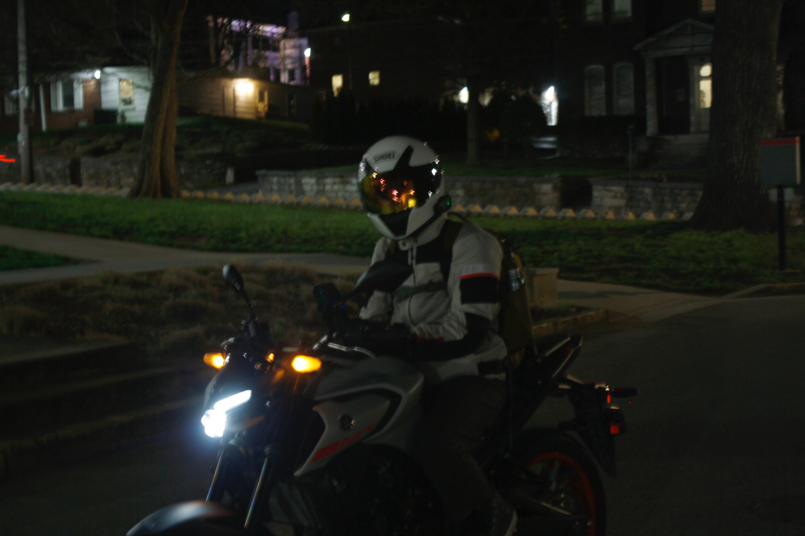
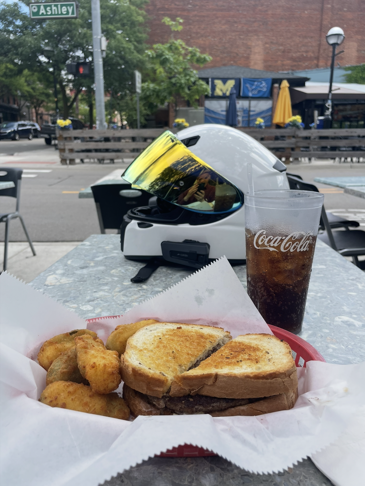

Hello there! 👋

I am a Ph.D. Pre-Candidate in the <a href="https://lsa.umich.edu/appliedphysics">Applied Physics</a> department at the University of Michigan, advised by <a href="https://ners.engin.umich.edu/people/thomas-alec/">Dr. Alec Thomas</a>, and currently working on high-power laser interactions with plasma. I received my B.Sc. in Physics with a minor in Mathematics from Western Kentucky University in the Spring of 2024 and now live in the beautiful city of Ann Arbor, Michigan.

Contrary to popular belief, us Physics graduate students do have lives outside of school. On that note, below is a collection of images that, in my opinion, accurately represent the life of the weirdly nerdy (but cool) person that is me! 

<article>
       
</article>
<article>
       
</article>
<article>
       
</article>
<article>
       
</article>

<h2>About this installation</h2>

 This website is designed, developed, and maintained by Leah Hartman. The site is hosted on <b>Github Pages</b> and is built with the <b>Jekyll</b> platform. 
